# HTML5 迷宮遊戲 - 技術規格文件

## 專案概述

本專案是一個基於 HTML5 Canvas 的互動式迷宮遊戲，支援桌面端鍵盤控制和移動端重力感應器操作。使用純原生 JavaScript (ES6) 實現遊戲邏輯，採用 Materialize CSS 框架提供響應式 UI。

### 技術棧

- **前端框架**: 純原生 HTML5 + JavaScript (ES6)
- **繪圖技術**: Canvas 2D API
- **UI 框架**: Materialize CSS v1.0.0
- **樣式**: CSS3
- **部署**: 靜態網站（GitHub Pages 相容）

---

## 架構設計

### 系統架構圖

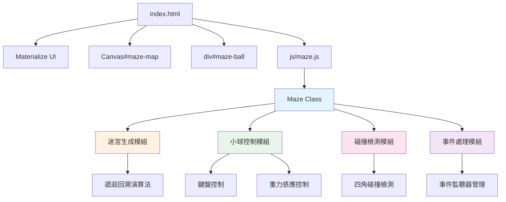

### 核心類別：Maze

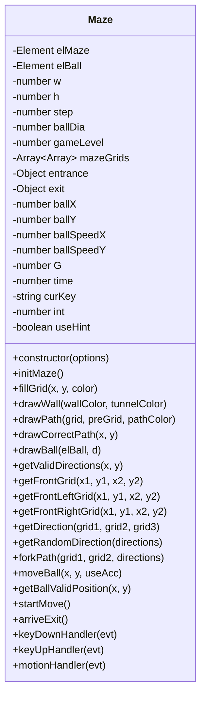

---

## 檔案結構

```
maze-game-114/
├── index.html              # 主頁面入口
├── css/
│   ├── index.css          # 自定義樣式（迷宮與小球）
│   └── materialize.min.css # UI 框架樣式
├── js/
│   ├── maze.js            # 核心遊戲邏輯
│   └── materialize.min.js  # UI 框架腳本
├── img/                   # 圖片資源
├── AGENTS.md              # 開發指南
├── CLAUDE.md              # AI 助手指引
├── README.md              # 專案說明
└── LICENSE                # MIT 授權
```

---

## 核心功能模組

### 1. 迷宮生成模組

#### 1.1 演算法：遞迴回溯法（Recursive Backtracking）

本專案採用修改版的遞迴回溯演算法，結合異步分叉機制生成隨機迷宮。

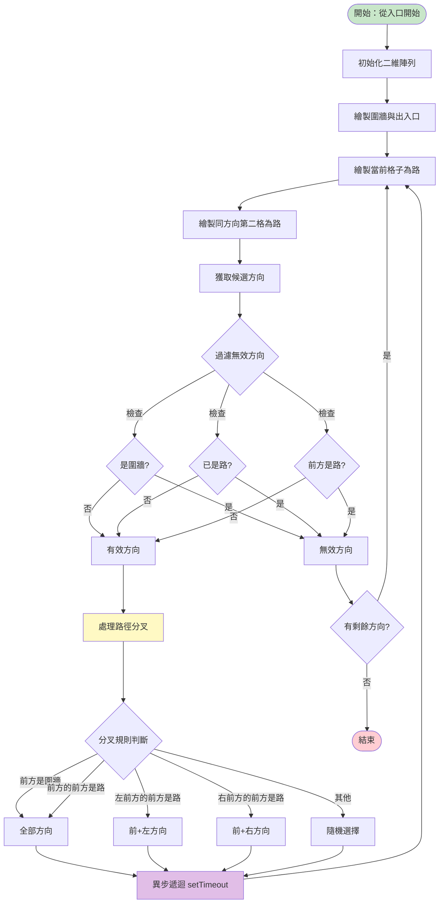

#### 1.2 關鍵特性

| 特性 | 說明 |
|------|------|
| **每次挖兩格** | 保證路徑間有牆分隔，確保迷宮結構穩定 |
| **異步遞迴** | 使用 `setTimeout(..., 0)` 實現多路徑並行挖掘 |
| **難度控制** | 透過 `gameLevel` (0-2) 控制分叉數量 |
| **分叉概率** | 多路徑分叉有 30% 機率限制（`maxRatio = 0.3`） |
| **路徑回溯** | 每個格子儲存 `preGrid` 鏈接，用於提示功能 |

#### 1.3 難度等級

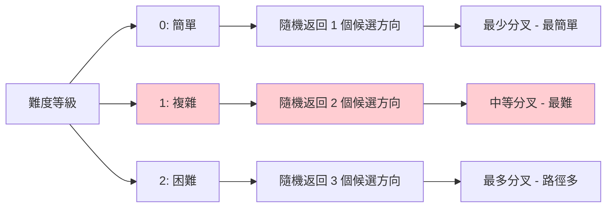

#### 1.4 格子資料結構

```javascript
mazeGrids[y][x] = {
    x: number,           // 格子 x 座標
    y: number,           // 格子 y 座標
    isWall: boolean,     // 是否為圍牆
    isEntrance: boolean, // 是否為入口
    isExit: boolean,     // 是否為出口
    isPath: boolean,     // 是否為路（挖路時設為 true）
    preGrid: {           // 父節點鏈接（用於回溯正確路徑）
        x: number,
        y: number
    } | null
}
```

---

### 2. 小球移動控制模組

#### 2.1 控制方式

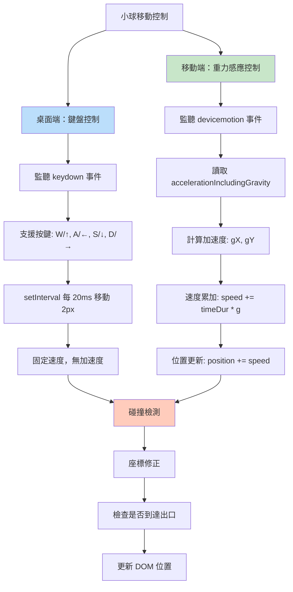

#### 2.2 鍵盤控制機制

| 屬性 | 值 | 說明 |
|------|-----|------|
| **支援按鍵** | `W`/`ArrowUp`, `A`/`ArrowLeft`, `S`/`ArrowDown`, `D`/`ArrowRight` | 方向控制 |
| **移動間隔** | 20ms | `setInterval` 觸發頻率 |
| **移動步長** | 2px | 每次移動的像素距離 |
| **速度模式** | 恆定速度 | `useAcc = false` |
| **防重複** | 檢查 `curKey` | 避免重複設定 interval |

**實作邏輯**：
```javascript
keyDownHandler(evt) {
    // 1. 阻止預設行為（防止頁面滾動）
    evt.preventDefault();
    
    // 2. 判斷按鍵對應方向
    if (key === 'W' || key === 'ArrowUp') curKey = 'up';
    // ... 其他方向
    
    // 3. 清除舊的 interval
    clearInterval(this.int);
    
    // 4. 設定新的 interval，每 20ms 移動 2px
    this.int = setInterval(() => {
        if (curKey === 'up') this.moveBall(0, -2, false);
        // ... 其他方向
    }, 20);
}
```

#### 2.3 重力感應控制機制

**物理模型**：
```
重力加速度 G = 9.8 m/s²

加速度計算：
gX = (G/1000) * (x/10)  // x ∈ [-10, 10]
gY = (G/1000) * (y/10)  // y ∈ [-10, 10]

速度更新：
speed += timeDur * g

位置更新：
position += speed
```

**軸向對應**：
- **X 軸**：右翻為負（`x < 0`），左翻為正（`x > 0`）
- **Y 軸**：後翻為正（`y > 0`），前翻為負（`y < 0`）

**速度重置條件**：
1. 時間間隔 `> 50ms`（視為停止）
2. 當前方向加速度為 `0`

---

### 3. 碰撞檢測模組

#### 3.1 檢測流程

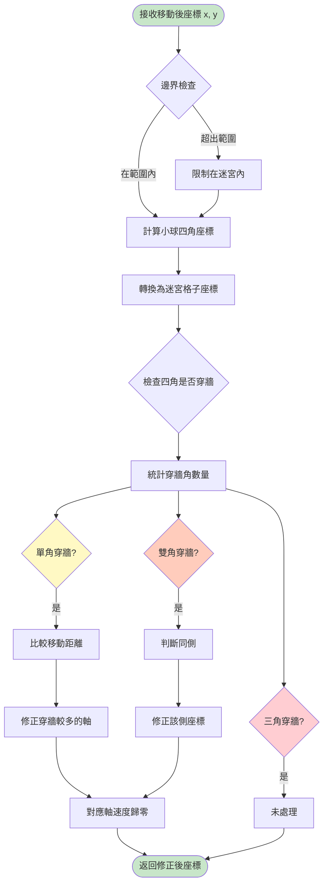

#### 3.2 座標轉換

**像素座標 → 迷宮格子座標**：
```javascript
gridX = ~~(pixelX / step)  // ~~ 等同於 Math.floor (正數)
gridY = ~~(pixelY / step)
```

**四角座標計算**：
```javascript
leftTop = { x: x, y: y }
rightTop = { x: x + ballDia, y: y }
leftBottom = { x: x, y: y + ballDia }
rightBottom = { x: x + ballDia, y: y + ballDia }
```

#### 3.3 碰撞修正規則

##### 單角穿牆（其他三角在路上）

比較移動距離，修正穿牆較多的軸：

```javascript
// 例：左上角穿牆
let moveLeft = ballX - (wallGrid.x + 1) * step;  // 向左穿牆距離
let moveTop = ballY - (wallGrid.y + 1) * step;   // 向上穿牆距離

if (moveLeft > moveTop) {
    // 向左穿牆較多，修正 x
    ballX = (wallGrid.x + 1) * step;
    ballSpeedX = 0;
} else {
    // 向上穿牆較多，修正 y
    ballY = (wallGrid.y + 1) * step;
    ballSpeedY = 0;
}
```

##### 雙角穿牆（必定同側）

| 穿牆情況 | 修正方式 |
|---------|---------|
| **左側兩角** | `ballX = (wallGrid.x + 1) * step` |
| **右側兩角** | `ballX = wallGrid.x * step - ballDia` |
| **上側兩角** | `ballY = (wallGrid.y + 1) * step` |
| **下側兩角** | `ballY = wallGrid.y * step - ballDia` |

##### 三角穿牆

目前未處理（極少發生，程式碼中有註解標記）。

---

### 4. 事件處理模組

#### 4.1 事件監聽器管理

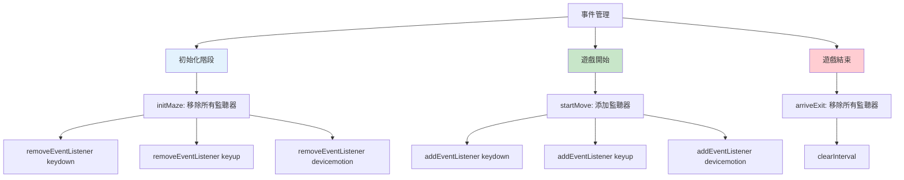

#### 4.2 事件綁定清單

| 元素/對象 | 事件類型 | 處理函式 | 觸發時機 | 用途 |
|----------|---------|---------|---------|------|
| `window` | `keydown` | `keyDownHandler` | 按下方向鍵 | 桌面端移動控制 |
| `window` | `keyup` | `keyUpHandler` | 釋放方向鍵 | 停止移動 |
| `window` | `devicemotion` | `motionHandler` | 設備傾斜 | 移動端重力控制 |
| `.start-game` | `click` | `startGame()` | 點擊按鈕 | 開始遊戲 |
| 重新生成按鈕 | `click` | `reGenMaze()` | 點擊按鈕 | 重新生成迷宮 |
| `.game-hint` | `click` | `drawHintPath()` | 點擊按鈕 | 顯示提示路徑 |
| `.maze-size` | `change` | 匿名函式 | 滑桿變化 | 調整地圖大小 |
| `.game-level` | `change` | 匿名函式 | 下拉選擇 | 調整難度 |

---

## DOM 結構與 UI 設計

### DOM 層級結構

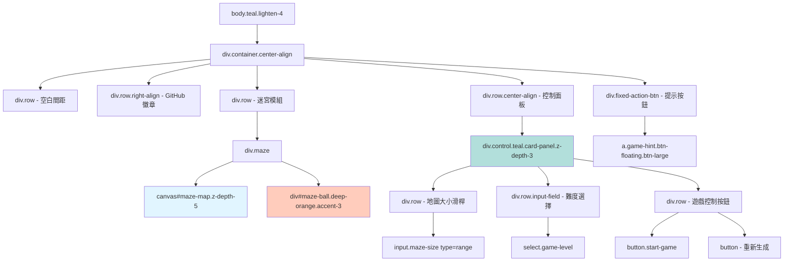

### 關鍵 DOM 元素

| 選擇器 | 元素類型 | ID/Class | 用途 |
|--------|---------|----------|------|
| `#maze-map` | `<canvas>` | maze-map | 迷宮繪製畫布 |
| `#maze-ball` | `<div>` | maze-ball | 小球視覺元素 |
| `.maze` | `<div>` | maze | 迷宮容器（相對定位） |
| `.control` | `<div>` | control | 控制面板 |
| `.start-game` | `<button>` | start-game | 開始遊戲按鈕 |
| `.game-level` | `<select>` | game-level | 難度選擇器 |
| `.maze-size` | `<input>` | maze-size | 地圖大小滑桿 |
| `.game-hint` | `<a>` | game-hint | 提示按鈕（浮動） |

---

## 樣式設計

### CSS 規則

#### 自定義樣式 (`css/index.css`)

```css
.maze {
    position: relative;      /* 相對定位容器，供小球絕對定位使用 */
    display: inline-block;   /* 行內區塊元素 */
}

#maze-ball {
    position: absolute;      /* 絕對定位（相對於 .maze） */
    border-radius: 50%;      /* 圓形視覺 */
    /* 寬高和位置由 JavaScript 動態設定 */
}
```

#### 動態樣式

**迷宮容器縮放**：
```javascript
elMazeWrapper.style.width = maze.w * maze.step + "px"
elMazeWrapper.style.zoom = elControl.clientWidth / (maze.w * maze.step)
```
- 根據控制面板寬度自動縮放迷宮，確保完整顯示

**小球樣式**：
```javascript
elBall.style.width = d + "px"          // 直徑
elBall.style.height = d + "px"         // 直徑
elBall.style.left = ballX + "px"       // X 座標
elBall.style.top = ballY + "px"        // Y 座標
```

**Canvas 背景色**：
```javascript
elMaze.style.background = "#4D4040"    // 內部牆顏色
```

### 顏色配置

| 元素 | 顏色值 | Materialize Class | 視覺效果 |
|------|--------|------------------|---------|
| **圍牆** | `#004d40` | - | 深青綠色 |
| **出入口** | `white` | - | 白色通道 |
| **內部牆** | `#4D4040` | - | 深灰色 |
| **路徑** | `#e0f2f1` | - | 淺青綠色 |
| **提示路徑** | `#ffe0b2` | - | 淺橙色 |
| **小球** | - | `deep-orange accent-3` | 深橙色 |
| **背景** | - | `teal lighten-4` | 淺青綠色 |
| **控制面板** | - | `teal` | 青綠色 |

---

## 配置參數

### 迷宮配置

| 參數 | 變數名 | 預設值 | 範圍 | 單位 | 說明 |
|------|--------|--------|------|------|------|
| **迷宮寬度** | `width` / `w` | 31 | 31-101 (奇數) | 格 | 必須為奇數 |
| **迷宮高度** | `height` / `h` | 31 | 31-101 (奇數) | 格 | 必須為奇數 |
| **單元格大小** | `step` | 10 | - | px | 每格像素大小 |
| **小球直徑** | `ballDia` | 6 | - | px | 小球視覺尺寸 |
| **遊戲難度** | `gameLevel` | 0 | 0-2 | - | 0=簡單, 1=複雜, 2=困難 |

**注意事項**：
- 迷宮尺寸必須為奇數，確保格子對齊
- 滑桿設定 `step="2"` 保證奇數值
- 最大地圖 101×101 有特殊通關彩蛋

### 物理常數

| 常數 | 變數名 | 值 | 單位 | 用途 |
|------|--------|-----|------|------|
| **重力加速度** | `G` | 9.8 | m/s² | 重力感應計算 |
| **速度重置閾值** | - | 50 | ms | 時間間隔超過此值速度歸零 |
| **鍵盤移動步長** | - | 2 | px | 每次移動距離 |
| **鍵盤移動間隔** | - | 20 | ms | `setInterval` 頻率 |
| **分叉概率上限** | `maxRatio` | 0.3 | - | 多路徑分叉機率 |

### 入口與出口座標

| 位置 | 變數名 | 座標 | 說明 |
|------|--------|------|------|
| **入口** | `entrance` | `{x: 1, y: 0}` | 固定在上方 |
| **出口** | `exit` | `{x: w-2, y: h-1}` | 固定在下方 |

---

## 遊戲狀態與流程

### 遊戲狀態機

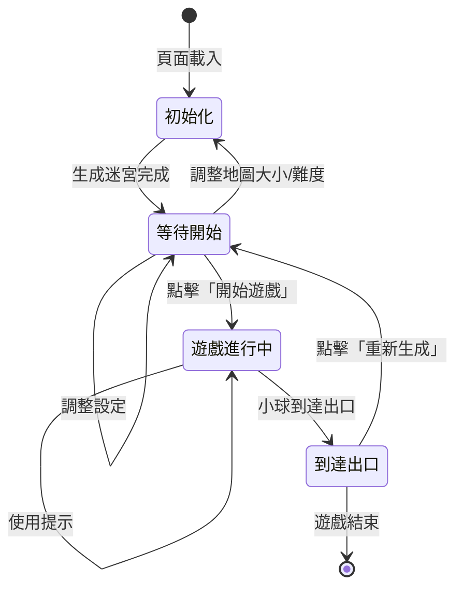

### 狀態標記屬性

| 屬性 | 類型 | 預設值 | 用途 |
|------|------|--------|------|
| `useHint` | boolean | `false` | 是否使用過提示（影響彩蛋） |
| `curKey` | string | `''` | 當前按鍵方向（防重複觸發） |
| `int` | number | `null` | `setInterval` ID（用於清除） |
| `time` | number | `null` | 上次調用時間戳（加速度計算） |

### 遊戲流程

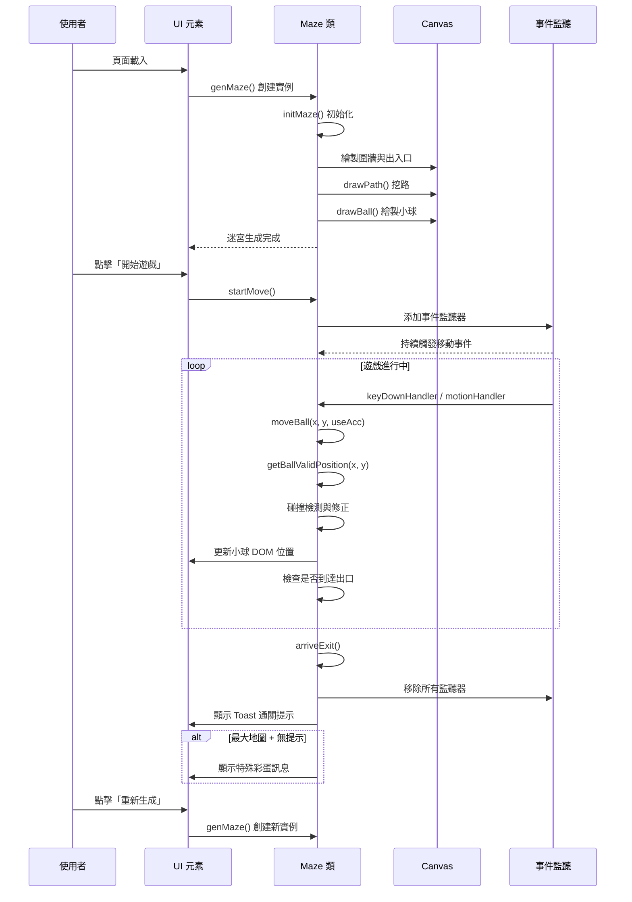

---

## 特殊功能

### 1. 提示功能

**功能描述**：點擊提示按鈕後，從入口到出口繪製正確路徑。

**實作機制**：
```javascript
drawCorrectPath(x, y) {
    // 從出口遞迴回溯到入口
    // 利用每個格子的 preGrid 鏈接
    if (grid.preGrid) {
        fillGrid(x, y, "#ffe0b2");  // 淺橙色
        drawCorrectPath(grid.preGrid.x, grid.preGrid.y);
    }
}
```

**視覺效果**：
- 提示路徑顏色：`#ffe0b2`（淺橙色）
- 與普通路徑顏色 `#e0f2f1` 區分

**狀態影響**：
- 設定 `useHint = true`
- 影響通關彩蛋觸發條件

### 2. 通關彩蛋

**觸發條件**：
```javascript
if (this.w === 101 && !this.useHint) {
    // 顯示特殊祝賀訊息
}
```

| 條件 | 說明 |
|------|------|
| `this.w === 101` | 地圖尺寸為最大（101×101） |
| `!this.useHint` | 未使用提示功能 |

**彩蛋內容**：顯示特別的祝賀 Toast 訊息。

### 3. 重力感應器檢測

**檢測流程**：

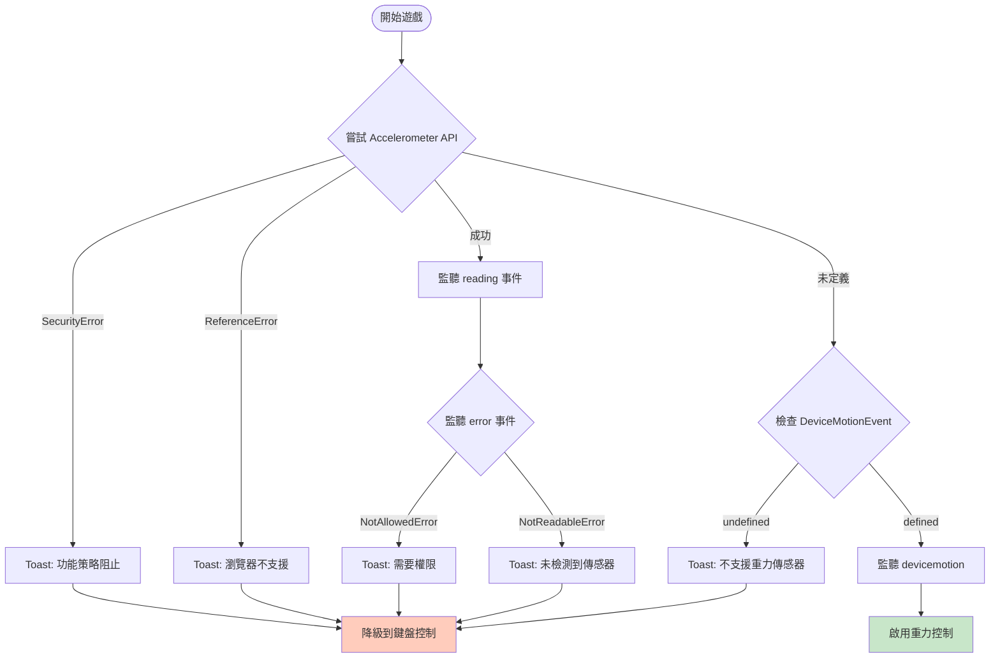

**錯誤處理**：

| 錯誤類型 | 說明 | Toast 訊息 |
|---------|------|-----------|
| `NotAllowedError` | 需要使用者權限 | 「重力傳感器需要權限」 |
| `NotReadableError` | 未檢測到傳感器 | 「未檢測到重力傳感器」 |
| `SecurityError` | 功能策略阻止 | 「功能策略阻止重力傳感器」 |
| `ReferenceError` | API 不存在 | 「瀏覽器不支援 Accelerometer API」 |
| `DeviceMotionEvent === undefined` | 舊版瀏覽器 | 「設備不支持重力傳感器，請使用鍵盤控制」 |

---

## API 參考

### 全域函式

#### `genMaze(options)`

**用途**：生成新迷宮實例

**參數**：
```javascript
{
    width: number,      // 可選，迷宮寬度
    height: number,     // 可選，迷宮高度
    gameLevel: number,  // 可選，難度等級
    // elMaze 和 elBall 自動傳入
}
```

**返回值**：`Maze` 實例

**副作用**：
- 啟用開始按鈕（移除 `disabled` class）
- 隱藏提示按鈕（添加 `scale-out` class）

---

#### `startGame()`

**用途**：開始遊戲

**操作流程**：
1. 調用 `maze.startMove()` 啟用移動控制
2. 禁用開始按鈕（添加 `disabled` class）
3. 檢測重力感應器支援
4. 顯示相應 Toast 提示
5. 5 秒後顯示提示按鈕

**無參數，無返回值**

---

#### `reGenMaze()`

**用途**：重新生成迷宮

**操作**：
- 讀取當前 `elMazeSize.value` 和 `elGameLevel.value`
- 調用 `genMaze()` 生成新迷宮

**無參數，無返回值**

---

#### `drawHintPath()`

**用途**：顯示提示路徑

**操作**：
1. 隱藏提示按鈕
2. 調用 `maze.drawCorrectPath(maze.exit.x, maze.exit.y)`

**無參數，無返回值**

---

### Maze 類公開方法

#### `constructor(options)`

**參數**：
```javascript
{
    elMaze: Element,        // 必需，Canvas 元素
    elBall: Element,        // 必需，小球 DOM 元素
    width: number,          // 可選，預設 31
    height: number,         // 可選，預設 31
    step: number,           // 可選，預設 10
    ballDia: number,        // 可選，預設 6
    gameLevel: number,      // 可選，預設 0
}
```

---

#### `initMaze()`

**用途**：初始化迷宮，重置遊戲狀態

**操作**：
1. 調整 Canvas 尺寸
2. 移除所有事件監聽器
3. 初始化 `mazeGrids` 二維陣列
4. 繪製圍牆和出入口
5. 執行挖路演算法
6. 繪製小球

**無參數，無返回值**

---

#### `startMove()`

**用途**：開始移動控制，添加事件監聽器

**監聽事件**：
- `window.addEventListener('keydown', this.keyDownHandler)`
- `window.addEventListener('keyup', this.keyUpHandler)`
- `window.addEventListener('devicemotion', this.motionHandler)`

**無參數，無返回值**

---

#### `moveBall(x, y, useAcc)`

**用途**：控制小球移動

**參數**：
- `x` (number): X 軸加速度比率（-10 到 10）或移動速度
- `y` (number): Y 軸加速度比率（-10 到 10）或移動速度
- `useAcc` (boolean): 是否使用重力加速度

**操作流程**：
1. 計算新速度（加速度模式）或直接累加（固定速度模式）
2. 更新座標
3. 碰撞檢測與修正
4. 檢查是否到達出口
5. 更新 DOM 位置

**無返回值**

---

#### `drawCorrectPath(x, y)`

**用途**：遞迴繪製正確路徑

**參數**：
- `x` (number): 當前格子 X 座標
- `y` (number): 當前格子 Y 座標

**操作**：
- 從出口開始，沿 `preGrid` 鏈接回溯到入口
- 繪製淺橙色路徑（`#ffe0b2`）

**無返回值**

---

## 依賴與資源

### JavaScript 依賴

| 檔案 | 版本 | 用途 |
|------|------|------|
| `materialize.min.js` | 1.0.0 | Materialize CSS 框架 |
| `maze.js` | - | 核心遊戲邏輯 |

**Materialize 使用**：
- `M.AutoInit()`: 初始化所有元件（下拉選單、範圍滑桿等）
- `M.toast({html: '訊息'})`: 顯示 Toast 通知

### CSS 依賴

| 檔案 | 用途 |
|------|------|
| `materialize.min.css` | 框架樣式（網格、卡片、按鈕等） |
| `index.css` | 自定義樣式（迷宮與小球） |

### 外部資源

- **GitHub 徽章**：
  - Stars: `https://img.shields.io/github/stars/knightyun/maze-game?style=social`
  - Forks: `https://img.shields.io/github/forks/knightyun/maze-game?style=social`
- **Favicon**: `./img/favicon.svg`

---

## 瀏覽器相容性

### 必需功能

| 功能 | API | 最低版本 |
|------|-----|---------|
| **Canvas 2D** | `CanvasRenderingContext2D` | Chrome 4+, Firefox 2+, Safari 3.1+ |
| **ES6 Class** | `class` 關鍵字 | Chrome 49+, Firefox 45+, Safari 9+ |
| **箭頭函式** | `() => {}` | Chrome 45+, Firefox 22+, Safari 10+ |
| **解構賦值** | `const {x, y} = obj` | Chrome 49+, Firefox 41+, Safari 8+ |

### 可選功能（降級支援）

| 功能 | API | 降級方案 |
|------|-----|---------|
| **重力感應** | `Accelerometer` | 使用 `DeviceMotionEvent` |
| **重力感應（舊版）** | `DeviceMotionEvent` | 顯示 Toast，降級到鍵盤控制 |

### 測試建議

**桌面端**：
- Chrome 最新版
- Firefox 最新版
- Safari 最新版
- Edge 最新版

**移動端**：
- iOS Safari 10+
- Android Chrome 60+

---

## 效能考量

### 潛在效能問題

| 問題 | 影響 | 建議 |
|------|------|------|
| **大地圖生成** | 101×101 迷宮挖路較慢 | 可加入 Loading 動畫 |
| **異步遞迴** | 大量 `setTimeout` 可能阻塞事件循環 | 目前可接受，無需優化 |
| **高頻事件** | `devicemotion` 觸發頻率高 | 可加入節流（throttle） |
| **DOM 操作** | 每次移動更新小球 `style` | 可使用 CSS Transform 優化 |

### 優化建議

1. **小球移動優化**：
   ```javascript
   // 當前
   elBall.style.left = ballX + "px";
   
   // 優化
   elBall.style.transform = `translate(${ballX}px, ${ballY}px)`;
   ```

2. **事件節流**：
   ```javascript
   let lastCall = 0;
   motionHandler(evt) {
       const now = Date.now();
       if (now - lastCall < 16) return;  // 約 60 FPS
       lastCall = now;
       // ... 原邏輯
   }
   ```

---

## 已知限制

### 功能限制

| 限制 | 說明 | 影響 |
|------|------|------|
| **三角穿牆** | 碰撞檢測未處理三角同時穿牆 | 極少發生，影響微小 |
| **固定入口出口** | 位置寫死，不可配置 | 無法自定義起終點 |
| **無歷史紀錄** | 無 localStorage 儲存 | 無法查看歷史成績 |
| **無暫停功能** | 開始後無法暫停 | 使用者體驗待改善 |
| **單一迷宮** | 一次只能玩一個迷宮 | 無多迷宮並行需求 |

### 技術債務

1. **程式碼組織**：所有邏輯在單一檔案 `maze.js`，可拆分模組
2. **魔術數字**：部分常數（如 0.3, 50ms）未提取為配置
3. **錯誤處理**：重力感應錯誤處理可更細緻
4. **測試覆蓋**：缺少自動化測試

---

## 擴展性設計

### 可擴展功能點

#### 1. 計時與統計（即將實作）

**建議實作**：
```javascript
class Maze {
    constructor(options) {
        // ... 現有屬性
        this.startTime = null;
        this.endTime = null;
        this.completionTime = null;
    }
    
    startMove() {
        this.startTime = Date.now();
        // ... 現有邏輯
    }
    
    arriveExit() {
        this.endTime = Date.now();
        this.completionTime = (this.endTime - this.startTime) / 1000;
        this.saveRecord();
        // ... 現有邏輯
    }
    
    saveRecord() {
        const key = `best_${this.w}_${this.gameLevel}`;
        const best = localStorage.getItem(key);
        if (!best || this.completionTime < parseFloat(best)) {
            localStorage.setItem(key, this.completionTime);
        }
    }
}
```

#### 2. 自定義主題

**建議實作**：
```javascript
const themes = {
    default: {
        wall: "#004d40",
        path: "#e0f2f1",
        hint: "#ffe0b2",
    },
    dark: {
        wall: "#212121",
        path: "#424242",
        hint: "#ff6f00",
    },
};
```

#### 3. 難度自定義

**建議實作**：
```javascript
const difficulties = {
    easy: { maxRatio: 0.1, directions: 1 },
    medium: { maxRatio: 0.3, directions: 2 },
    hard: { maxRatio: 0.5, directions: 3 },
    custom: { maxRatio: customValue, directions: customDirs },
};
```

---

## 開發指令

### 本地開發

```bash
# Node.js 環境
npx http-server . -c-1
# 訪問 http://localhost:8080

# Python 環境
python3 -m http.server 4173
# 訪問 http://localhost:4173
```

### 程式碼檢查

```bash
# 檢查格式
npx prettier --check "{css,js}/*.{css,js}"

# 自動修正
npx prettier --write "{css,js}/*.{css,js}"
```

### 部署

**靜態網站託管**：
- GitHub Pages
- Netlify
- Vercel

**部署步驟**：
1. 推送程式碼到 Git 倉庫
2. 啟用靜態網站託管
3. 設定根目錄為專案根目錄
4. 訪問提供的網址

---

## 附錄

### A. 座標系統

```
Canvas 座標系：
  0,0 ─────────> X
   │
   │
   │
   ▼
   Y

迷宮座標系（格子索引）：
  0,0 ─────────> X (格)
   │
   │
   │
   ▼
   Y (格)

轉換公式：
  像素 X = 格子 X × step
  像素 Y = 格子 Y × step
  格子 X = ~~(像素 X / step)
  格子 Y = ~~(像素 Y / step)
```

### B. 方向編碼

| 方向 | 字串值 | 鍵盤按鍵 | 加速度軸 |
|------|--------|---------|---------|
| **上** | `'up'` | `W` / `ArrowUp` | `y < 0` |
| **下** | `'down'` | `S` / `ArrowDown` | `y > 0` |
| **左** | `'left'` | `A` / `ArrowLeft` | `x < 0` |
| **右** | `'right'` | `D` / `ArrowRight` | `x > 0` |

### C. 格子狀態組合

| `isWall` | `isPath` | `isEntrance` | `isExit` | 說明 |
|----------|---------|-------------|---------|------|
| `true` | `false` | `false` | `false` | 圍牆 |
| `false` | `true` | `false` | `false` | 普通路徑 |
| `false` | `false` | `true` | `false` | 入口 |
| `false` | `false` | `false` | `true` | 出口 |
| `false` | `false` | `false` | `false` | 未挖掘的內部區域 |

### D. 事件處理優先級

```
優先級（高 → 低）：
1. arriveExit() - 到達出口立即停止所有監聽
2. getBallValidPosition() - 碰撞檢測阻止非法移動
3. moveBall() - 正常移動處理
4. keyDownHandler / motionHandler - 輸入事件
```

---

## 版本歷史

| 版本 | 日期 | 變更內容 |
|------|------|---------|
| 1.0.0 | - | 初始版本，核心迷宮遊戲功能 |

---

## 授權

本專案採用 MIT License 授權。詳見 [LICENSE](LICENSE) 檔案。

---

## 參考資源

- **Materialize CSS**: https://materializecss.com/
- **Canvas API**: https://developer.mozilla.org/en-US/docs/Web/API/Canvas_API
- **Accelerometer API**: https://developer.mozilla.org/en-US/docs/Web/API/Accelerometer
- **DeviceMotionEvent**: https://developer.mozilla.org/en-US/docs/Web/API/DeviceMotionEvent
- **遞迴回溯演算法**: https://en.wikipedia.org/wiki/Maze_generation_algorithm#Recursive_backtracker

---

**文件版本**: 1.0.0  
**最後更新**: 2025年11月14日  
**維護者**: [專案團隊]
