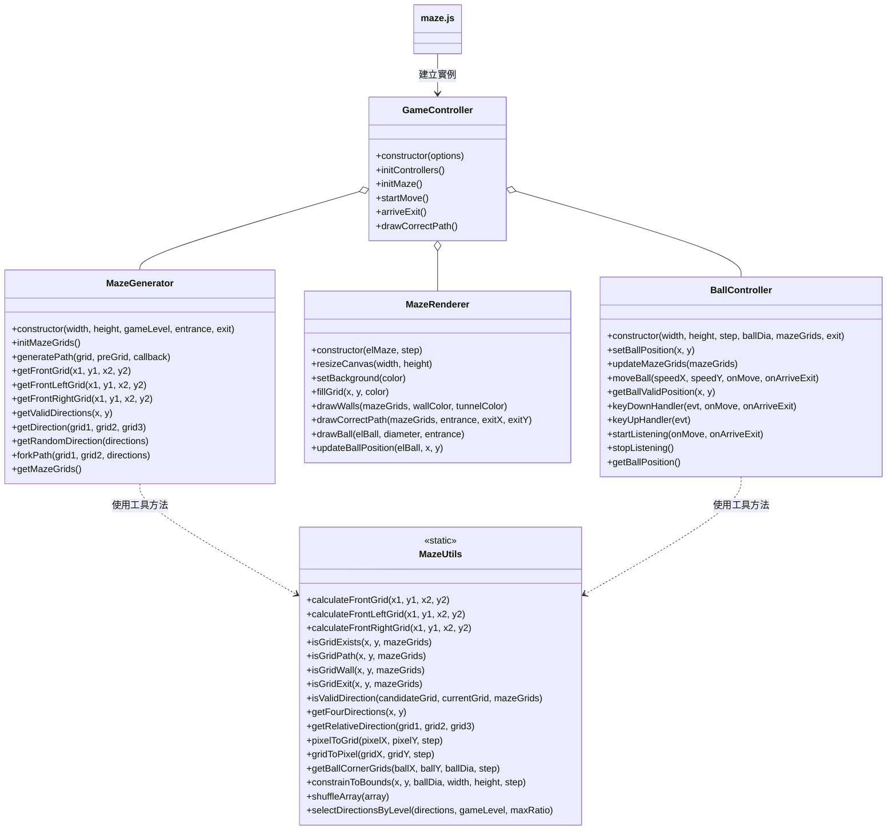

# SPEC_GAME_CORE — 迷宮遊戲核心規格（教學版）

## 1. 專案簡介（Overview）

- **遊戲目標**：控制畫面上的小球，從迷宮入口走到出口，途中不能穿牆。
- **技術重點**：
  - 使用 Canvas 繪製迷宮牆壁、路徑、出入口與小球位置。
  - 使用遞迴回溯演算法生成隨機迷宮。
  - 使用鍵盤事件（WASD / 方向鍵）控制小球，搭配碰撞偵測。
- **核心模組一覽**：
  - `maze.js`：入口腳本，負責 DOM 綁定、全域常數與遊戲啟動。
  - `GameController`：遊戲主控制器，協調迷宮生成、渲染與小球控制。
  - `MazeGenerator`：負責迷宮網格資料與路徑生成。
  - `MazeRenderer`：負責所有迷宮與小球的繪圖。
  - `BallController`：負責小球位置、移動與碰撞判斷、鍵盤控制。
  - `MazeUtils`：純函式工具，提供座標換算、方向判斷與難度控制等輔助。

---

## 2. 遊戲流程說明（Game Flow）

### 2.1 頁面載入與初始設定

1. HTML 載入完成後，`maze.js` 執行：
   - 使用 `document.querySelector` 取得：
     - `#maze-map`（迷宮 Canvas）
     - `#maze-ball`（小球 DOM）
     - `.maze`（迷宮容器）
     - `.control`（控制列容器）
     - `.start-game`（「開始遊戲」按鈕）
     - `.game-level`（難度選單）
     - `.maze-size`（迷宮尺寸選單）
     - `.game-hint`（提示按鈕）
   - 定義 `GAME_CONSTANTS`：
     - 預設迷宮大小 / 單元格大小 / 小球直徑
     - 小球每次移動的像素量與更新延遲
     - 迷宮生成分叉比例、提示延遲、入口/出口偏移、最大迷宮尺寸等。
2. 呼叫 `genMaze()` 建立初始迷宮與 `GameController` 實例：
   - 未傳入任何 options → 使用預設常數。
   - 儲存為全域變數 `maze`。

3. 根據 `maze.width` 與 `maze.step` 設定：
   - `.maze` 寬度（像素）
   - `.maze` 的 `zoom`（縮放比例），使迷宮適應 `.control` 寬度。

### 2.2 生成迷宮（`genMaze` → `GameController` → `MazeGenerator`/`MazeRenderer`/`BallController`）

1. `genMaze(options)`：
   - 合併預設 options：
     - `elMaze` = 迷宮 Canvas
     - `elBall` = 小球 DOM
   - 開啟「開始遊戲」按鈕（移除 `disabled`，加上 `pulse`）。
   - 隱藏提示按鈕（`scale-out`）。
   - 回傳新的 `GameController` 實例。

2. `new GameController(options)`：
   - 儲存 `elMaze`, `elBall`, `width`, `height`, `step`, `ballDia`, `gameLevel`。
   - 根據 `GAME_CONSTANTS` 計算：
     - 入口 `entrance = { x: ENTRANCE_X_OFFSET, y: ENTRANCE_Y_OFFSET }`
     - 出口 `exit = { x: width - EXIT_X_OFFSET, y: height - EXIT_Y_OFFSET }`
   - 設定 `useHint = false`。
   - 呼叫：
     - `initControllers()`
     - `initMaze()`

3. `GameController.initControllers()`：
   - 建立 `mazeGenerator = new MazeGenerator(width, height, gameLevel, entrance, exit)`
   - 建立 `renderer = new MazeRenderer(elMaze, step)`
   - 建立 `ballController = new BallController(width, height, step, ballDia, [], exit)`
     - 先以空陣列作為 `mazeGrids`，稍後由 `updateMazeGrids` 更新。

4. `GameController.initMaze()`：
   1. `renderer.resizeCanvas(width, height)`：設定 Canvas 實際像素大小。
   2. `mazeGenerator.initMazeGrids()`：建立二維陣列 `mazeGrids`，標記：
      - 外圈牆 (`isWall`)、入口 (`isEntrance`)、出口 (`isExit`)、路徑 (`isPath = false`)。
   3. 取得 `const mazeGrids = mazeGenerator.getMazeGrids()`
   4. `renderer.drawWalls(mazeGrids, "#004d40", "white")`：畫出牆與出入口。
   5. `renderer.setBackground("#4D4040")`：設定內部背景色。
   6. 定義 `pathCallback(x, y)`：
      - 使用 `renderer.fillGrid(x, y, "#e0f2f1")` 將路徑格著色。
   7. 呼叫 `mazeGenerator.generatePath(entrance, { x: 1, y: -1 }, pathCallback)`：
      - 從入口起點與一個「虛擬前一格」開始遞迴挖路。
   8. `ballController.updateMazeGrids(mazeGrids)`：
      - 提供迷宮格資訊給小球碰撞邏輯使用，並重設 `hasReachedExit = false`。
   9. `const ballPos = renderer.drawBall(elBall, ballDia, entrance)`：
      - 根據 `entrance` 計算小球像素座標並安置在畫面上。
   10. `ballController.setBallPosition(ballPos.x, ballPos.y)`：
       - 在小球控制器內同步小球位置。

### 2.3 開始遊戲與小球移動（`startGame` → `GameController.startMove` → `BallController`）

1. 使用者按下「開始遊戲」按鈕 → `startGame()`：
   - 呼叫 `maze.startMove()`。
   - 將 `.start-game` 加上 `disabled`、移除 `pulse`。
   - 使用 `M.toast` 顯示「遊戲開始」提示。
   - 設定 `setTimeout`：在 `GAME_CONSTANTS.HINT_DELAY_MS` 後顯示「提示」按鈕。

2. `GameController.startMove()`：
   - 定義 `onMove(x, y)`：
     - 呼叫 `renderer.updateBallPosition(elBall, x, y)` 更新小球 DOM 位置。
   - 定義 `onArriveExit()`：
     - 呼叫 `this.arriveExit()`。
   - 呼叫 `ballController.startListening(onMove, onArriveExit)`：
     - 開始監聽鍵盤事件，進入移動迴圈。

3. `BallController.startListening(onMove, onArriveExit)`：
   - `window.addEventListener("keydown", (evt) => this.keyDownHandler(evt, onMove, onArriveExit))`
   - `window.addEventListener("keyup", this.keyUpHandler)`

4. `BallController.keyDownHandler(evt, onMove, onArriveExit)`：
   - `evt.preventDefault()`：阻止頁面捲動等預設行為。
   - 讀取 `GAME_CONSTANTS.BALL_MOVE_STEP` 與 `GAME_CONSTANTS.MOVE_DELAY_MS`。
   - 根據按鍵 (`w/a/s/d` 或 `ArrowUp/Left/Down/Right`)：
     - 決定小球移動方向與速度 `(speedX, speedY)`。
     - 更新 `curKey`（目前方向）。
     - 使用 `setInterval` 以固定間隔呼叫 `moveBall(speedX, speedY, onMove, onArriveExit)`。

5. `BallController.moveBall(speedX, speedY, onMove, onArriveExit)`：
   1. 計算未限制前的下一步位置：
      - `ballX += speedX`
      - `ballY += speedY`
   2. 呼叫 `getBallValidPosition(ballX, ballY)`：
      - 回傳 `{ x, y }`，為修正後的有效位置。
      - 同時依邊界/碰撞狀況調整 `ballSpeedX` / `ballSpeedY`。
   3. 更新 `this.ballX`, `this.ballY`。
   4. 檢查是否到達出口（只觸發一次）：
      - 若 `!hasReachedExit` 且
        - `ballX >= exit.x * step`
        - `ballY >= exit.y * step`
      - 則：
        - 設 `hasReachedExit = true`
        - 呼叫 `onArriveExit()`
   5. 呼叫 `onMove(this.ballX, this.ballY)` 通知外界更新畫面。

6. `BallController.keyUpHandler(evt)`：
   - `evt.preventDefault()`
   - 重置 `curKey = ''`
   - `window.clearInterval(this.moveInterval)`

### 2.4 通關流程與提示路徑

1. 通關流程：`GameController.arriveExit()`：
   - `ballController.stopListening()`：
     - 移除 `keydown` / `keyup` 事件監聽。
     - 清除 `moveInterval`。
     - 重置 `curKey`。
   - 根據條件顯示不同 `M.toast` 訊息：
     - 若 `width === GAME_CONSTANTS.MAX_MAZE_SIZE` 且 `useHint === false`：
       - 顯示「通關最大地圖且未使用提示」特別祝賀。
     - 否則顯示一般通關訊息。
   - 提示玩家「請重新開始遊戲」。

2. 顯示提示路徑：`drawHintPath()` → `GameController.drawCorrectPath()`：
   - 在 `maze.js` 中：
     - 隱藏提示按鈕（`scale-out`）。
     - 呼叫 `maze.drawCorrectPath()`。
   - 在 `GameController.drawCorrectPath()` 中：
     - 設 `useHint = true`。
     - 取得 `mazeGrids = mazeGenerator.getMazeGrids()`。
     - 呼叫 `renderer.drawCorrectPath(mazeGrids, entrance, exit.x, exit.y)`：
       - 從出口格開始，使用每格的 `preGrid` 一路往回畫到入口。

### 2.5 推薦 Mermaid 流程圖

#### 2.5.1 遊戲主流程

```mermaid
flowchart TD
    A[頁面載入] --> B[讀取 DOM & 定義 GAME_CONSTANTS]
    B --> C[呼叫 genMaze(預設設定)]
    C --> D[建立 GameController 實例]
    D --> E[initControllers: 建立 MazeGenerator, MazeRenderer, BallController]
    E --> F[initMaze: 建立 mazeGrids, 畫牆, 挖路, 畫球]
    F --> G[等待玩家操作: 調整尺寸/難度 或 按開始遊戲]
    G -->|按開始| H[GameController.startMove]
    H --> I[BallController.startListening: 鍵盤控制小球]
    I --> J{是否到達出口?}
    J -->|否| I
    J -->|是| K[GameController.arriveExit: 停止控制 & 顯示通關訊息]
    G -->|按提示鍵| L[GameController.drawCorrectPath: 畫出解答路徑]
```

#### 2.5.2 類別關係圖



---

## 3. 核心類別規格（Class Specs）

> 建議教學時每個類別一小節說明「職責 → 建構子 → 屬性 → 方法 → 使用情境」。

### 3.1 `GameController` — 遊戲主控制器

- **職責**：
  - 表示一局遊戲的狀態與流程。
  - 建立並管理 `MazeGenerator` / `MazeRenderer` / `BallController`。
  - 定義入口與出口座標、難度與提示使用狀態。
  - 提供開始遊戲與繪製解答路徑的入口方法。

- **constructor(options)**：
  - 主要參數：
    - `options.elMaze: Element` — 迷宮 Canvas 元素。
    - `options.elBall: Element` — 小球 DOM 元素。
    - `options.ballDia?: number` — 小球直徑（預設 `GAME_CONSTANTS.DEFAULT_BALL_DIAMETER`）。
    - `options.width?: number` — 迷宮寬度（格數，預設 `DEFAULT_MAZE_SIZE`）。
    - `options.height?: number` — 迷宮高度（格數）。
    - `options.step?: number` — 單元格大小（像素）。
    - `options.gameLevel?: number` — 難度等級。
  - 建構流程：
    1. 儲存 options 至實例屬性。
    2. 計算 `entrance` 與 `exit`。
    3. 設定 `useHint = false`。
    4. 呼叫 `initControllers()`。
    5. 呼叫 `initMaze()`。

- **關鍵屬性（教學列舉）**：
  - `elMaze`, `elBall`
  - `width`, `height`, `step`, `ballDia`, `gameLevel`
  - `entrance: {x, y}`
  - `exit: {x, y}`
  - `useHint: boolean`
  - `mazeGenerator: MazeGenerator`
  - `renderer: MazeRenderer`
  - `ballController: BallController`

- **主要方法與呼叫時機**：
  - `initControllers()`：
    - 建立三個子控制器。
    - 呼叫時機：建構子內。
  - `initMaze()`：
    - 初始化迷宮網格、畫牆、挖路、更新小球資料與初始位置。
    - 呼叫時機：
      - 建構子內（每次新遊戲）。
  - `startMove()`：
    - 建立小球移動與到達出口的回呼。
    - 呼叫 `ballController.startListening(onMove, onArriveExit)`。
    - 呼叫時機：玩家按下「開始遊戲」後。
  - `arriveExit()`：
    - 停止小球控制（鍵盤事件）。
    - 根據是否使用提示與地圖大小顯示通關訊息。
    - 呼叫時機：小球抵達出口時由 `BallController` 透過回呼觸發。
  - `drawCorrectPath()`：
    - 設 `useHint = true`。
    - 呼叫 `renderer.drawCorrectPath`，從出口逆向標出正確路徑。
    - 呼叫時機：玩家按下「提示」按鈕時。

### 3.2 `MazeGenerator` — 迷宮生成器

- **職責**：
  - 負責建立迷宮網格資料結構 `mazeGrids`。
  - 以遞迴回溯法生成迷宮路徑。
  - 控制分叉與路線複雜度（搭配難度與 `MazeUtils`）。
  - 記錄每格的 `preGrid` 以支援解答路徑的繪製。

- **constructor(width, height, gameLevel, entrance, exit)**：
  - `width: number` — 迷宮寬度（格數）。
  - `height: number` — 迷宮高度（格數）。
  - `gameLevel: number` — 難度等級（0：簡單，1：複雜，2：困難）。
  - `entrance: {x, y}` — 入口座標。
  - `exit: {x, y}` — 出口座標。
  - 初始化：
    - `this.mazeGrids = []`

- **主要屬性**：
  - `width`, `height`, `gameLevel`, `entrance`, `exit`
  - `mazeGrids: Array<Array<Grid>>`（Grid 物件包含 `x, y, isWall, isPath, isEntrance, isExit, preGrid` 等）

- **主要方法**：
  - `initMazeGrids()`：
    - 依 `width`, `height` 建立二維陣列。
    - 外框標記為牆 (`isWall = true`)，中間為待挖路格。
    - 指定入口/出口格並標記 `isEntrance` / `isExit`。
  - `generatePath(grid, preGrid, callback)`：
    - 傳入：
      - `grid`：當前格 `{x, y}`。
      - `preGrid`：前一格 `{x, y}`。
      - `callback(x, y)`：畫路用函式。
    - 核心流程：
      1. 在 `mazeGrids[y][x]` 設定 `preGrid`。
      2. 若當前格為出口：
         - 呼叫 `callback(x, y)`，設 `isPath = true`，結束。
      3. 使用 `getFrontGrid` 求前方格，若當前格或前方格已為路：
         - 結束（避免路徑交叉）。
      4. 依序對當前格與前方格：
         - 呼叫 `callback` 畫路。
         - 設 `isPath = true`，並設定 `preGrid`。
      5. 呼叫 `getValidDirections(frontX, frontY)` 取得候選方向。
      6. 若 `directions.length === 0` → 結束。
      7. 呼叫 `forkPath(grid, frontGrid, directions)` 篩選要挖的方向。
      8. 對每個方向透過 `setTimeout` 遞迴呼叫 `generatePath`。
  - `getFrontGrid(x1, y1, x2, y2)`：
    - 使用 `MazeUtils.calculateFrontGrid` 推算前方格。
    - 若存在於 `mazeGrids` 即回傳對應格物件，否則 `null`。
  - `getFrontLeftGrid(...)` / `getFrontRightGrid(...)`：
    - 類似 `getFrontGrid`，改用左前/右前計算。
  - `getValidDirections(x, y)`：
    - 取得四個基本方向 `MazeUtils.getFourDirections`。
    - 使用 `MazeUtils.isValidDirection` 過濾出合法候選格。
    - 將 `{x, y}` 座標轉成對應的格物件。
  - `getDirection(grid1, grid2, grid3)`：
    - 呼叫 `MazeUtils.getRelativeDirection` 判斷第三格位於前方 / 左側 / 右側。
  - `getRandomDirection(directions)`：
    - 呼叫 `MazeUtils.selectDirectionsByLevel(directions, gameLevel, GAME_CONSTANTS.FORK_MAX_RATIO)` 決定要保留的方向。
  - `forkPath(grid1, grid2, directions)`：
    - 分析候選方向在前方/左/右方的情況。
    - 根據「前方是否是牆」、「前方的前方是否是路」、左右前方是否為路等條件：
      - 決定必須挖的方向。
      - 或使用隨機策略在 `randomDirections` 中挑選。
  - `getMazeGrids()`：
    - 回傳 `mazeGrids` 給 `GameController` 使用。

### 3.3 `MazeRenderer` — 迷宮渲染器

- **職責**：
  - 操作 Canvas 畫出迷宮牆、路徑、入口與出口。
  - 利用 `preGrid` 資訊畫出正確解答路徑。
  - 初始化小球位置與持續更新小球 DOM 座標。

- **constructor(elMaze, step)**：
  - `elMaze: HTMLCanvasElement`
  - `step: number` — 一格的像素大小。

- **主要屬性**：
  - `elMaze`
  - `step`
  - `canvasContext = elMaze.getContext("2d")`

- **主要方法**：
  - `resizeCanvas(width, height)`：
    - 設定 `elMaze.width = width * step`、`elMaze.height = height * step`。
  - `setBackground(color)`：
    - 設定 `elMaze.style.background = color`。
  - `fillGrid(x, y, color)`：
    - 用 `fillRect(x * step, y * step, step, step)` 將單一格塗色。
  - `drawWalls(mazeGrids, wallColor, tunnelColor)`：
    - 走訪二維陣列：
      - `grid.isWall` → 牆色。
      - `grid.isEntrance` / `grid.isExit` → 出入口色。
  - `drawCorrectPath(mazeGrids, entrance, exitX, exitY)`：
    - 自 `(exitX, exitY)` 開始：
      - 用 `fillGrid` 標示路徑色（例如 `#ffe0b2`）。
      - 若已到達入口座標，停止。
      - 否則讀取 `mazeGrids[exitY][exitX].preGrid`，遞迴追溯。
  - `drawBall(elBall, diameter, entrance)`：
    - 計算小球初始像素位置：
      - `ballX = entrance.x * step`
      - `ballY = entrance.y * step`
    - 設定 `elBall.style.width/height/left/top`。
    - 回傳 `{ x: ballX, y: ballY }`。
  - `updateBallPosition(elBall, x, y)`：
    - 更新 `elBall.style.left/top`。

### 3.4 `BallController` — 小球控制器

- **職責**：
  - 管理小球的像素座標與移動速度。
  - 限制小球在迷宮範圍內，避免穿牆（基於四角格子判斷）。
  - 處理鍵盤按下與放開事件，啟動或停止移動迴圈。
  - 在小球抵達出口時透過回呼通知 `GameController`。

- **constructor(width, height, step, ballDia, mazeGrids, exit)**：
  - `width, height`：迷宮格數。
  - `step`：每格的像素大小。
  - `ballDia`：小球直徑（像素）。
  - `mazeGrids`：迷宮網格資料（二維陣列）。
  - `exit`：出口座標（格子）。
  - 初始化：
    - 小球位置 `ballX`, `ballY`。
    - 速度 `ballSpeedX`, `ballSpeedY`。
    - `curKey = ''`。
    - `moveInterval = null`。
    - `hasReachedExit = false`。
    - 綁定 `keyDownHandler` / `keyUpHandler` 到實例。

- **主要方法**：
  - `setBallPosition(x, y)`：
    - 設定 `ballX`, `ballY`。
  - `updateMazeGrids(mazeGrids)`：
    - 更新內部 `mazeGrids` 並重設 `hasReachedExit = false`。
  - `moveBall(speedX, speedY, onMove, onArriveExit)`：
    - 計算新位置 → 呼叫 `getBallValidPosition` → 更新座標。
    - 若未觸發過出口且已跨過出口格子對應像素：
      - 設 `hasReachedExit = true` → 呼叫 `onArriveExit()`。
    - 呼叫 `onMove(ballX, ballY)`。
  - `getBallValidPosition(x, y)`：
    - 呼叫 `MazeUtils.constrainToBounds(...)`：
      - 修正出界情況，並根據 `needStopX` / `needStopY` 歸零對應速度。
    - 使用 `MazeUtils.getBallCornerGrids(x, y, ballDia, step)` 計算四個角的格子。
    - 透過 `MazeUtils.isGridPath` 判斷每個角是否在路上。
    - 根據「哪幾個角不是路」：
      - 判斷小球是往哪一側穿牆（左 / 右 / 上 / 下），修正 `x` 或 `y`。
      - 把該方向速度 (`ballSpeedX` / `ballSpeedY`) 設為 0。
    - 回傳 `{x, y}`。
  - `keyDownHandler(evt, onMove, onArriveExit)`：
    - 阻止預設行為。
    - 根據 `evt.key` 決定方向（WASD / Arrow keys）。
    - 每次方向改變：
      - 更新 `curKey`。
      - 清除舊 `moveInterval`。
      - 使用 `setInterval` 週期性呼叫 `moveBall(...)`。
  - `keyUpHandler(evt)`：
    - 阻止預設行為，清除 `moveInterval`，重置 `curKey`。
  - `startListening(onMove, onArriveExit)`：
    - 綁定 `keydown` / `keyup` 事件。
  - `stopListening()`：
    - 移除事件監聽，清除 `moveInterval`，重置 `curKey`。
  - `getBallPosition()`：
    - 回傳 `{x: ballX, y: ballY}`。

### 3.5 `MazeUtils` — 迷宮工具類

- **職責**：
  - 提供「不帶狀態」的純函式工具，協助：
    - 計算前方 / 左前方 / 右前方格子。
    - 檢查格子是否存在/是路/是牆/是出口。
    - 判斷方向（前、左、右）。
    - 迷宮格與像素座標的轉換。
    - 小球四角格子與邊界限制。
    - 選擇候選方向（控制難度）、打亂陣列等。

- **主要方法分類**：

1. **方向相關**：
   - `calculateFrontGrid(x1, y1, x2, y2)`：
     - 根據「前一格→當前格」向量計算「同方向下一格」。
   - `calculateFrontLeftGrid(x1, y1, x2, y2)`：
     - 在前方格座標的基礎上偏左。
   - `calculateFrontRightGrid(x1, y1, x2, y2)`：
     - 類似，但偏右。
   - `getFourDirections(x, y)`：
     - 回傳上/下/左/右四個格子的 `{x, y}`。
   - `getRelativeDirection(grid1, grid2, grid3)`：
     - 判斷第三格對第二格是「前」/「左」/「右」。

2. **格子檢查**：
   - `isGridExists(x, y, mazeGrids)`
   - `isGridPath(x, y, mazeGrids)`
   - `isGridWall(x, y, mazeGrids)`
   - `isGridExit(x, y, mazeGrids)`

3. **候選方向合法性**：
   - `isValidDirection(candidateGrid, currentGrid, mazeGrids)`：
     - 若格子不存在 → 無效。
     - 若為出口 → 有效。
     - 否則：
       - 計算 `frontCoord = calculateFrontGrid(currentX, currentY, x, y)`。
       - 若 `frontCoord` 不存在 → 無效。
       - 若 `candidate` 或 `frontCoord` 已為牆或路 → 無效。
       - 其餘 → 有效。

4. **座標轉換與小球角落**：
   - `pixelToGrid(pixelX, pixelY, step)` / `gridToPixel(gridX, gridY, step)`。
   - `getBallCornerGrids(ballX, ballY, ballDia, step)`：
     - 回傳 `{ leftTop, leftBottom, rightTop, rightBottom }` 四個格子座標。

5. **邊界限制**：
   - `constrainToBounds(x, y, ballDia, width, height, step)`：
     - 針對左/上/右/下邊界調整 `x` / `y`，並回傳是否需停止該方向速度：
       - `{ x, y, needStopX, needStopY }`

6. **隨機與難度控制**：
   - `shuffleArray(array)`：
     - 使用 Fisher-Yates 洗牌，打亂陣列。
   - `selectDirectionsByLevel(directions, gameLevel, maxRatio)`：
     - 根據 `gameLevel` 決定保留幾個候選方向：
       - 確保分叉數量不超過 `maxRatio * directions.length`。
       - 難度越高，保留的候選方向越多。

---

## 4. 入口腳本 `maze.js` 規格

- **職責**：
  - 定義全域常數 `GAME_CONSTANTS`。
  - 取得必要 DOM 元素。
  - 建立 `GameController` 實例並儲存在全域變數 `maze`。
  - 處理 UI 事件（開始遊戲、變更地圖尺寸/難度、顯示提示）。

- **主要常數：`GAME_CONSTANTS`**：
  - 預設值：
    - `DEFAULT_MAZE_SIZE`、`DEFAULT_CELL_SIZE`、`DEFAULT_BALL_DIAMETER`、`DEFAULT_GAME_LEVEL`
  - 移動控制：
    - `BALL_MOVE_STEP`、`MOVE_DELAY_MS`
  - 迷宮生成：
    - `FORK_MAX_RATIO`
  - UI：
    - `HINT_DELAY_MS`
  - 入口與出口偏移：
    - `ENTRANCE_X_OFFSET`, `ENTRANCE_Y_OFFSET`
    - `EXIT_X_OFFSET`, `EXIT_Y_OFFSET`
  - 特殊地圖：
    - `MAX_MAZE_SIZE`

- **主要全域變數**：
  - DOM 元素：`elMaze`, `elBall`, `elMazeWrapper`, `elControl`, `elStartGame`, `elGameLevel`, `elMazeSize`, `elGameHint`
  - 遊戲實例：`let maze = genMaze();`

- **主要函式**：
  - `genMaze(options)`：
    - 合併預設選項與傳入選項。
    - 啟用「開始遊戲」按鈕、隱藏「提示」按鈕。
    - 回傳 `new GameController(_options)`。
  - `reGenMaze()`：
    - 根據目前 `maze-size` 與 `game-level` 的值呼叫 `genMaze(...)`。
  - `startGame()`：
    - 呼叫 `maze.startMove()`。
    - UI：禁用「開始遊戲」按鈕與動畫。
    - 使用 `M.toast` 顯示開始提示。
    - 過 `HINT_DELAY_MS` 顯示提示按鈕。
  - `drawHintPath()`：
    - 隱藏提示按鈕。
    - 呼叫 `maze.drawCorrectPath()`。

- **事件監聽**：
  - `elMazeSize.change`：
    - 重新 `genMaze`（使用新尺寸與目前難度）。
    - 更新 `.maze` 寬度與 `zoom`。
  - `elGameLevel.change`：
    - 重新 `genMaze`（使用目前尺寸與新難度）。

---

## 5. 類別關係與互動（總結）

- `maze.js`：
  - 建立與重建 `GameController` 實例（`maze`）。
  - 呼叫 `maze.startMove()` 與 `maze.drawCorrectPath()`。
- `GameController`：
  - 建立 `MazeGenerator` / `MazeRenderer` / `BallController`。
  - 使用 `MazeGenerator` 生成 `mazeGrids`。
  - 使用 `MazeRenderer` 畫牆、畫路徑、畫小球與更新位置。
  - 使用 `BallController` 監聽鍵盤事件並控制小球。
- `MazeGenerator`：
  - 使用 `MazeUtils` 計算方向與驗證候選格。
- `BallController`：
  - 使用 `MazeUtils`：
    - 限制小球在邊界內、計算小球四角格子、檢查路/牆。
  - 藉由回呼通知 `GameController`：
    - 小球移動時 → 更新畫面。
    - 抵達出口時 → 執行通關流程。

---

## 6. 延伸練習題目（Practice Ideas）

> 可作為課堂作業或自我挑戰題目。

1. **迷宮尺寸與視覺調整**
   - 練習 1：新增更多地圖尺寸選項（例如 15×15、51×51），觀察迷宮密度差異。
   - 練習 2：允許使用者輸入任意奇數尺寸（限制在 `MAX_MAZE_SIZE` 內），並確保畫面縮放正常。

2. **難度策略調整**
   - 練習 3：修改 `MazeUtils.selectDirectionsByLevel`，讓高難度迷宮有更多分叉與死路。
   - 練習 4：根據 `gameLevel` 改變牆壁顏色或路徑顏色，視覺化難度。

3. **控制方式擴充**
   - 練習 5：新增滑鼠/觸控控制，例如按住方向鍵以外的 UI 按鈕也能移動小球。
   - 練習 6：嘗試加入重力感測（手機傾斜控制），需改寫 `BallController` 的事件來源。

4. **遊戲體驗優化**
   - 練習 7：加入計時器，顯示通關時間，並在通關訊息中一併顯示。
   - 練習 8：記錄是否有使用提示，通關時額外顯示「完美通關」或「有使用提示」。
   - 練習 9：在迷宮路徑中加入「加速區」或「陷阱格」，影響小球速度或顯示特效。

5. **程式架構重構與測試**
   - 練習 10：將 `maze.js` 中的全域邏輯改寫為 `App` 類別，便於多實例或測試。
   - 練習 11：為 `MazeUtils` 撰寫單元測試，驗證座標與方向計算是否正確。
   - 練習 12：為 `BallController.getBallValidPosition` 撰寫測試案例，驗證各種穿牆情境下的修正結果。
